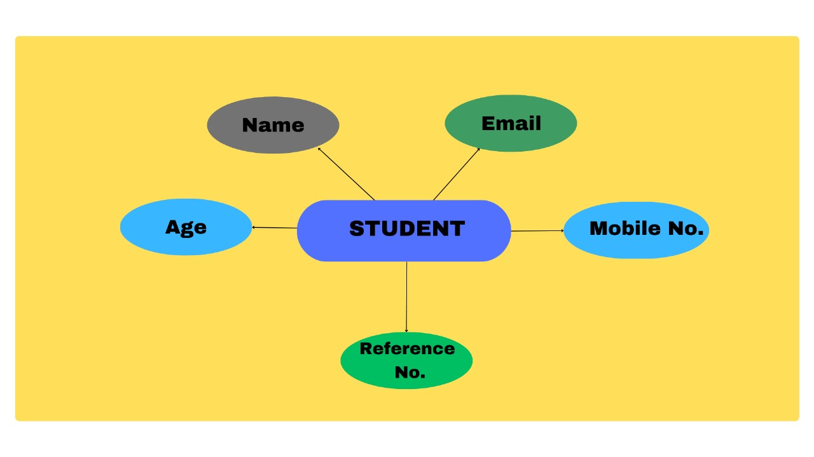
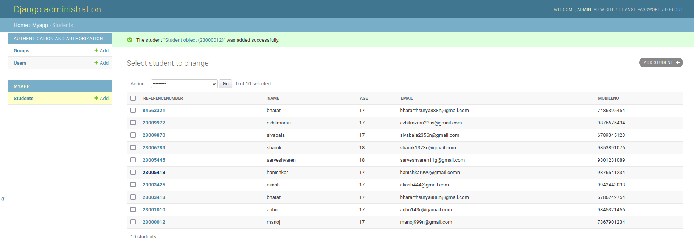

# Django ORM Web Application

## AIM
To develop a Django application to store and retrieve data from a database using Object Relational Mapping(ORM).

## Entity Relationship Diagram



## DESIGN STEPS

### STEP 1:
clone repository from github.

### STEP 2:
write codes in models.py and urls.py modify setting.py

### STEP 3:
run django project

## PROGRAM

Include your code here

### models.py
```python
from django.db import models
from django.contrib import admin

# Create your models here.
class Student (models.Model):
    referencenumber=models.CharField(primary_key=True,max_length=20,help_text="reference number")
    name=models.CharField(max_length=100)
    age=models.IntegerField()
    email=models.EmailField()
    mobileno=models.IntegerField()


class StudentAdmin(admin.ModelAdmin):
    list_display=('referencenumber','name','age','email','mobileno')
```
### admin.py
```python
from django.contrib import admin
from .models import Student,StudentAdmin

# Register your models here.
admin.site.register(Student,StudentAdmin)
```
## OUTPUT




## RESULT
